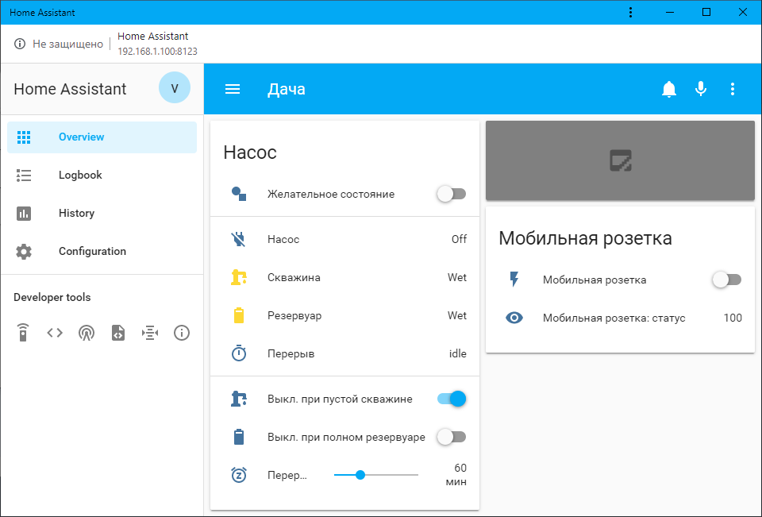

## Remote access
##### TL;DR
Server: `ssh -R dacha:22:localhost:22 serveo.net`. `autossh`, to be precise.
Client: `ssh -J serveo.net -i ~/.ssh/homeassistant@dacha_id_ed25519 -L 8000:localhost:8123 homeassistant@dacha`, where `homeassistant@dacha_id_ed25519` is a private SSH key for server user `homeassistant`. Then go to `localhost:8000`.

In order for two computers to communicate via internet, there must be one with a real IP. As most (if not all) of ISPs currently use NAT (it's called CG-NAT), we can't directly connect clients and the server.
There are a couple of solutions:
- IPv6

    For now, not many ISPs are willing to support it.
- Rent a dedicated IP from ISP

    Expensive
- Use an intermediate host, where we can set up a reverse SSH tunnel. Like "serveo.net".

    If it's down, communication will be interrupted. It can be solved by setting up an additional tunnel on a different server.
    Also, "serveo.net" currently doesn't load using "MTS" ISP.
- VPN

    Has to be expensive

We decided to use "serveo.net".

SSHD config's at `/etc/ssh/sshd_config`

## OS
The system's set up on Linux Mint.

## Firewall (UFW)
We know that there is router NAT usually. Additional measures won't hurt.

The UFW is disabled by default. Config files at `/etc/ufw/` are the results of:

```
ufw default deny incoming
ufw default allow outgoing
ufw allow ssh
ufw enable
```

The result of `sudo ufw status verbose`:
```
Status: active
Logging: on (low)
Default: deny (incoming), allow (outgoing), deny (routed)
New profiles: skip

To                         Action      From
--                         ------      ----
22/tcp                     ALLOW IN    Anywhere
22/tcp (v6)                ALLOW IN    Anywhere (v6)
```

## Autorun
`/etc/systemd/system/home-assistant@homeassistant.service`

## Camera
This automation server is set up according to [this](https://www.home-assistant.io/blog/2016/06/23/usb-webcams-and-home-assistant/) and [this](https://www.home-assistant.io/components/camera/) and uses `motion` package (`sudo apt install motion`).

Config's at `etc/motion/motion.conf`.

#### /diff-gen.sh
Makes it easier to see what's been changed in the config files.
